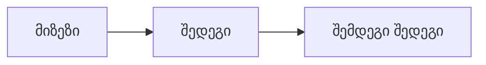
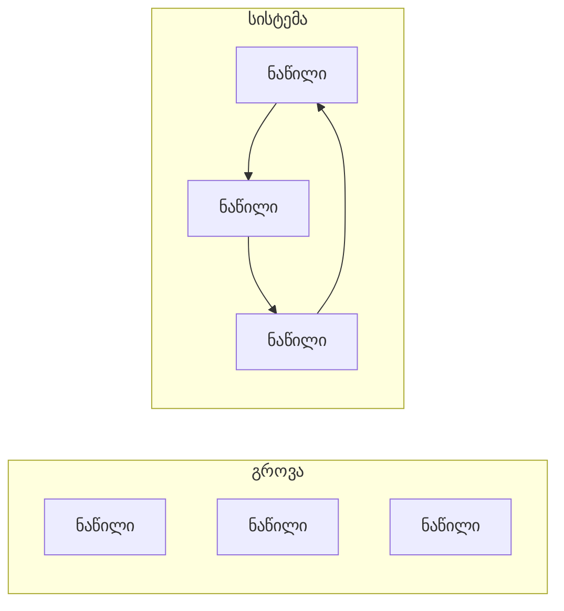
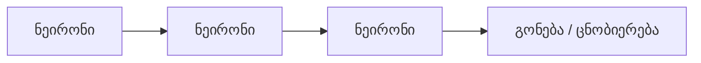
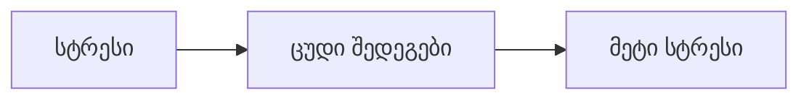
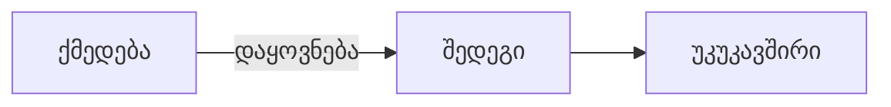
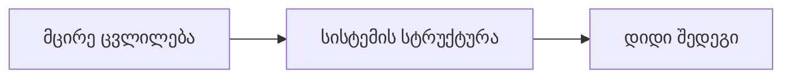
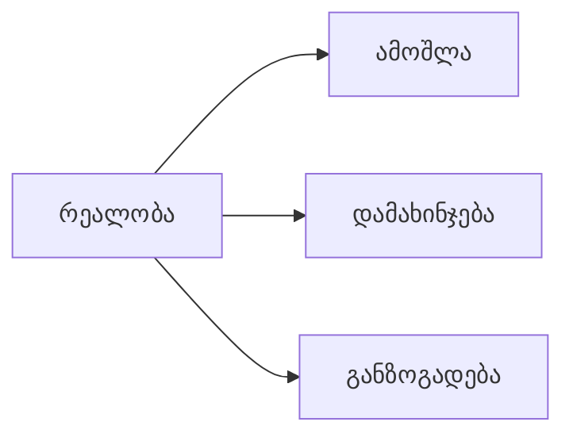
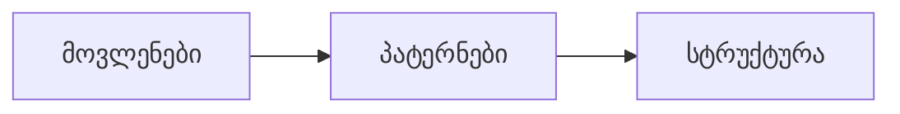

# სისტემური აზროვნების ხელოვნება — რეზიუმე

## მიმოხილვა

„სისტემური აზროვნების ხელოვნება“ ხსნის, თუ როგორ გავიგოთ რთული პრობლემები მათი აღქმით, როგორც ურთიერთდაკავშირებული სისტემების და არა როგორც იზოლირებული მოვლენების. რეალურ სამყაროში არსებული პრობლემების უმეტესობა ვერ გადაიჭრება ხაზოვანი აზროვნებით; ისინი მოითხოვენ ფოკუსირებას ურთიერთობებზე, უკუკავშირის მარყუჟებზე და დროში ჩამოყალიბებულ პატერნებზე.

> **სისტემა** არის ერთიანობა, რომელიც ინარჩუნებს თავის არსებობას და ფუნქციონირებს როგორც მთლიანობა მისი ნაწილების ურთიერთქმედების შედეგად.

---

## მთავარი იდეა: სწორხაზოვანი აზროვნებიდან სისტემურ აზროვნებამდე

* **სწორხაზოვანი** (მცდარია რთული სისტემებისთვის): A → B → C
* **სისტემური** (სწორია): A ↔ B ↔ C (წრიული მიზეზ-შედეგობრიობა)

### სისტემური ციკლი

### გროვა vs სისტემა

- გროვა (Heap): ნაწილებს შორის მნიშვნელოვნად არ არის ურთიერთქმედება.
- სისტემა (System): ნაწილები ურთიერთდამოკიდებულ შედეგებს ქმნიან; აქ შეიძლება წარმოიქმნას ემერჯენცია.

### ემერჯენცია

ემერჯენტული თვისებები წარმოიქმნება ნაწილების ურთიერთქმედების შედეგად და არ არის უბრალოდ მათი ერთეულების ჯამი.

## უკუკავშირის მარყუჟები (Feedback Loops)

### გამაძლიერებელი მარყუჟი (Reinforcing)

### დამაბალანსებელი მარყუჟი (Balancing)

დამაბალანსებელი მარყუჟები ინარჩუნებენ სისტემის სტაბილურობას; გამაძლიერებელი მარყუჟები აჩქარებენ ცვლილებებს.

## წრიული აზროვნება და დაყოვნება

### წრიული აზროვნება

### დაყოვნება (Delay)

დაყოვნება ხშირად ამახინჯებს სისტემის რეალურ შედეგებს და აფერხებს სწორი რეაგირების მიღებას.

## გაუთვალისწინებელი შედეგები

ეს არის კლასიკური "Fixes that fail" პათერნი — სწრაფი გასწორება, რომელიც შექმნის უფრო მტავიან პრობლემებს.

## ბერკეტის წერტილები (Leverage Points)

ფოკუსირდით სტრუქტურაზე და უკუკავშირზე — მცირედული, მიზნობრივი ცვლილებები ხშირად უფრო ეფექტურია.

## მენტალური მოდელები და დამახინჯება

მენტალური მოდელები დაგვეხმარებიან სირთულის შეჯამებაში, მაგრამ შეიძლება წარმოშვას დამახინჯებული ხედვა.

## სისტემური არქეტიპები

- მანკიერი ციკლი — პრობლემა თავის თავს კვებავს.
- გამოსავალი, რომელიც მარცხდება — მოკლევადიანი შვება, გრძელვადიანი პრობლემა.
- პასუხისმგებლობის გადატანა — მოკლევადიანი გადაწყვეტილება ხანგრძლივ დამოკიდებულებას ქმნის.

## ძირითადი პრინციპები

- სტრუქტურა განსაზღვრავს ქცევას.
- ყველაფერი დაკავშირებულია.
- უკუკავშირის მარყუჟები მართავენ სისტემებს.
- დაყოვნება ამახინჯებს აღქმას.
- მცირე ცვლილებებს ხშირად დიდი ეფექტი აქვს.

## დასკვნა

პრობლემების უმეტესობა სისტემურ სტრუქტურებს უკავშირდება. ფოკუსირება სტრუქტურაზე, უკუკავშირზე და ბერკეტებსა და არა მხოლოდ სიმპტომებზე, გვეშველება მდგრადი გადაწყვეტილებებისკენ.

