# სისტემური აზროვნების ხელოვნება — სიღრმისეული პრაქტიკული რეზიუმე


---

## 0. რას მოგცემთ ეს დოკუმენტი

ეს დოკუმენტი ცვლის წიგნს. იგი სტრუქტურირებულია **გამოყენებისთვის**, არა მხოლოდ თეორიისთვის.

თუ ამას გაითავისებთ, თქვენ შეძლებთ:

* პრობლემების სწრაფ დიაგნოსტირებას
* არასწორ გადაჭრის გზებზე ენერგიის ხარჯვის შეწყვეტას
* ისეთი სისტემების აგებას, რომლებიც ავტომატურად მუშაობენ

---

## 1. მთავარი ცვლილება: მოვლენები → სისტემები

**ჩვეულებრივი აზროვნება**

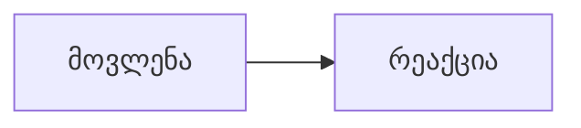

**სისტემური აზროვნება**

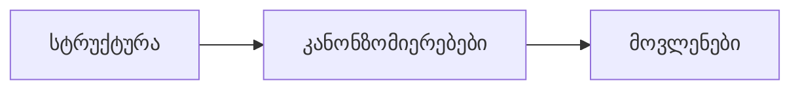

### ინტერპრეტაცია

* **მოვლენები** — რასაც ხედავთ
* **კანონზომიერებები (Patterns)** — ტენდენციები დროში
* **სტრუქტურა** — საფუძვლად მდებარე სისტემა, რომელიც ყველაფერს წარმოშობს

### მაგალითი (სტუდენტი)

* **მოვლენა:** ჩაჭრილი გამოცდა
* **კანონზომიერება:** დაბალი მოსწრება რამდენიმე საგანში
* **სტრუქტურა:** გამეორების ციკლის არარსებობა + spaced repetition-ის ნაკლებობა

👉 მოვლენის გამოსწორება = **უსარგებლოა**
👉 სტრუქტურის გამოსწორება = **მუდმივი შედეგი**

---

## 2. რა არის სისტემა (ზუსტი განმარტება)

**სისტემა = ელემენტები + კავშირები + მიზანი**

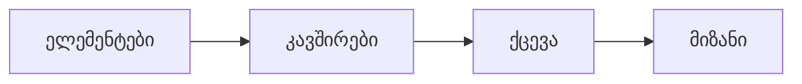

### მაგალითი (სავარჯიშო დარბაზი)

* **ელემენტები:** სხეული, საკვები, ვარჯიშები
* **კავშირები:** ჩვევები, განრიგი
* **მიზანი:** ადაპტაცია (გაძლიერება)

👉 ცუდი შედეგები ⇒ პრობლემა **კავშირებშია**, არა ძალისხმევაში

---

## 3. სტრუქტურა განსაზღვრავს ქცევას (მწარე სიმართლე)

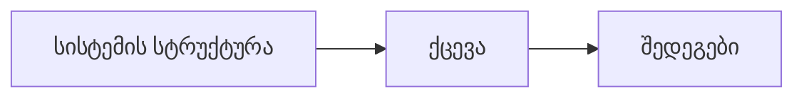

### მაგალითი (პროდუქტიულობა)

* შეტყობინებები ჩართული → ყურადღების გაფანტვა → დაბალი შედეგი
* შეტყობინებები გამორთული → ფოკუსი → მაღალი შედეგი

👉 ერთი და იგივე ადამიანი. განსხვავებული სისტემა.

> **დასკვნა:** პრობლემა დისციპლინაში კი არა, **სისტემის დიზაინშია**

---

## 4. უკუკავშირის მარყუჟები — ძრავი

ყველაფერი მნიშვნელოვანი არის **მარყუჟი (loop)**.

### 4.1 გამაძლიერებელი მარყუჟი (ზრდა / კოლაფსი)

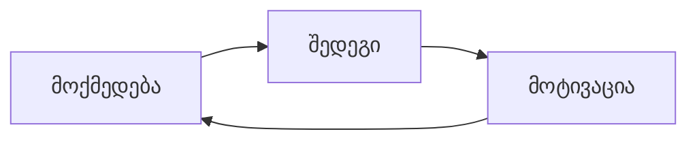

* **პოზიტიური (სწავლა):** პრობლემების გადაჭრა → გაუმჯობესება → თავდაჯერებულობა → მეტი ამოცანის გადაჭრა
* **ნეგატიური (არიდება):** დავალების არიდება → შვება → მეტი არიდება → უნარის დეგრადაცია

> **წესი:** გამაძლიერებელი მარყუჟები დროში მცირე სხვაობებს **მასშტაბურს** ხდიან

### 4.2 დამაბალანსებელი მარყუჟი (სტაბილურობა)

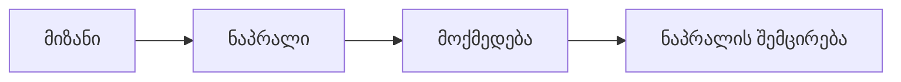

**მაგალითი (სხეულის წონა):** ნაკლების ჭამა → წონის კლება → შიმშილის ზრდა → მეტის ჭამა

> **წესი:** თუ ცვლილება რთულია — დამაბალანსებელი მარყუჟი **გეწინააღმდეგებათ**

---

## 5. მარყუჟების კომბინაცია (რეალური სისტემები)

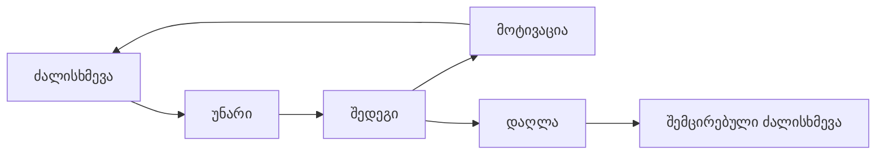

* პროგრესი ზრდის მოტივაციას (**გამაძლიერებელი**)
* დაღლა ამცირებს აქტივობას (**დამაბალანსებელი**)

👉 ოსტატობა = ორივე მარყუჟის მართვა

---

## 6. დროის დაყოვნება (ფარული მკვლელი)

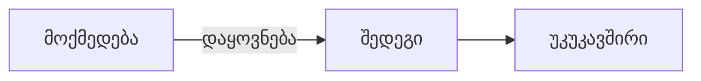

* სწავლა დღეს → შედეგი კვირებში
* ცუდი ძილი → ზიანი გროვდება → მოგვიანებით კრახი

**შეცდომა:**

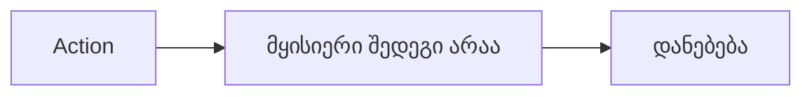

**სწორი მიდგომა:**

* წინასწარ განსაზღვრე ჰორიზონტი
* იგნორირება გაუკეთე მოკლევადიან სიგნალებს

👉 თუ დაყოვნება არსებობს — ენდე პროცესს, არა ემოციებს

---

## 7. არაწრფივი ეფექტები

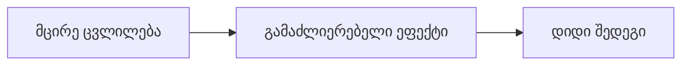

მაგალითი: 1% ყოველდღიური გაუმჯობესება → მასშტაბური წლიური ზრდა

👉 სისტემები **არ არის წრფივი**

---

## 8. „მუშაობს, მაგრამ მარცხდება“ (Fixes That Fail)

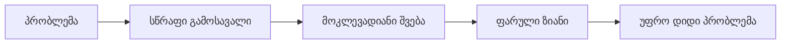

* ტკივილი → აბები → მიზეზის იგნორირება → გაუარესება
* კოდში ჰაკი → მუშაობს → ტექნიკური ვალი → კრახი

> **წესი:** თუ გამოსავალი მაშინვე მუშაობს — იყავით **ეჭვიანი**

---

## 9. პასუხისმგებლობის გადატანა (Shifting the Burden)

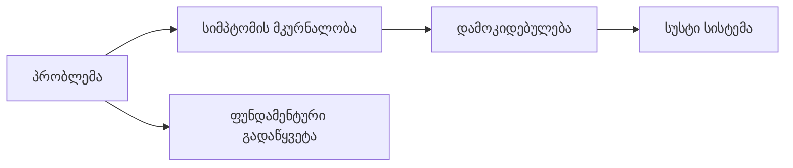

მაგალითი: StackOverflow → კოდის კოპირება → გაგების გარეშე

👉 აგვარებთ დავალებას, არა კომპეტენციას

**წესი:** ეს მაძლიერებს თუ მასუსტებს?

---

## 10. ბერკეტის წერტილები (Leverage Points)

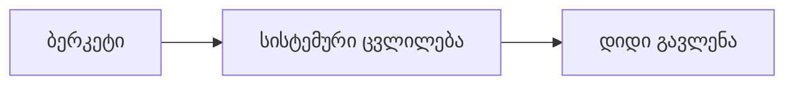

**ძალა (ზემოდან ქვემოთ):**

1. წესები
2. ინფორმაციის ნაკადი
3. სტრუქტურა
4. პარამეტრები (სუსტი)

**მაგალითი (სწავლა):**

* ❌ მეტი მეცადინეობა (პარამეტრი)
* ✅ ფიქსირებული გრაფიკი (სტრუქტურა)
* ✅ ტელეფონის მოცილება (გარემო)

👉 შეცვალეთ სისტემა, არა ძალისხმევა

---

## 11. მენტალური მოდელები = შიდა სისტემები

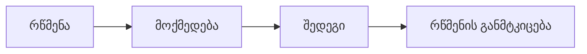

მაგალითი: „კოდირება არ მეხერხება“ → არ ვვარჯიშობ → ცუდი შედეგი → რწმენა მტკიცდება

👉 მარყუჟი ბლოკავს იდენტობას

**გატეხვა:** შექმენით საწინააღმდეგო მტკიცებულება

---

## 12. აზროვნების დამახინჯებები

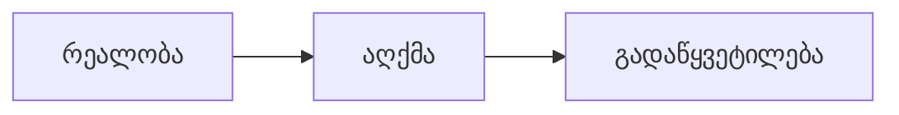

* წაშლა (Deletion)
* დამახინჯება (Distortion)
* განზოგადება (Generalization)

👉 საჭიროა **ზუსტი მონაცემი**

---

## 13. სისტემური არქეტიპები

### 13.1 მანკიერი წრე

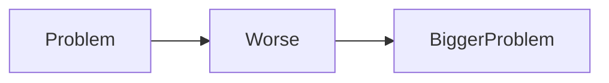

მაგალითი: სტრესი → ცუდი ძილი → მეტი სტრესი

### 13.2 წარმატება წარმატებულს

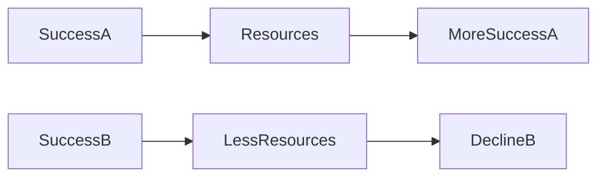

### 13.3 ზრდის ლიმიტები

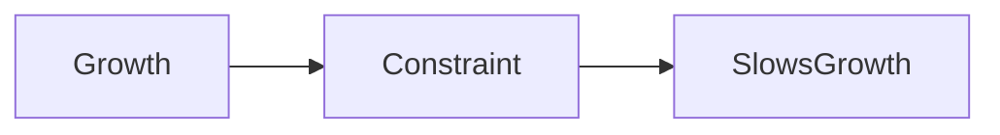

---

## 14. პრაქტიკული დიზაინი (ნაბიჯები)

1. იპოვე პატერნი (რა მეორდება?)
2. დახაზე მარყუჟი

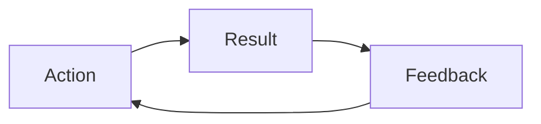

3. განსაზღვრე ტიპი (reinforcing / balancing)
4. იპოვე დაყოვნება
5. აირჩიე ბერკეტი (შეცვალე სტრუქტურა)

---

## 15. რეალური გამოყენებები

### 15.1 სწავლა

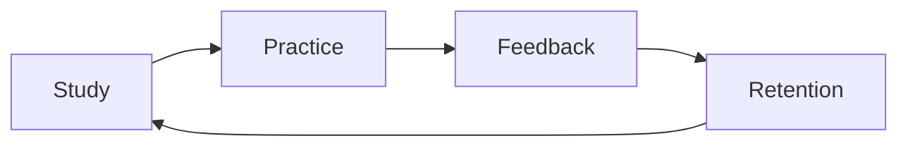

* დაამატე spaced repetition
* დაამატე ტესტირების მარყუჟი

### 15.2 პროდუქტიულობა

```mermaid
flowchart LR
  Environment --> Focus --> Output --> Satisfaction --> Motivation
```

👉 ყველაზე ძლიერი ბერკეტი = გარემო

### 15.3 ჯანმრთელობა

```mermaid
flowchart LR
  Sleep --> Energy --> Activity --> Health --> Sleep
```

👉 ჯერ ძილი

### 15.4 ფული

```mermaid
flowchart LR
  Income --> Investment --> Growth --> Income
```

👉 გამაძლიერებელი მარყუჟი = სიმდიდრე

---

## 16. ანტი-პატერნები

* მოვლენებზე რეაგირება
* დაყოვნებების იგნორირება
* სწრაფი ფიქსები
* ადამიანების დადანაშაულება
* ძალისხმევის ზრდა სისტემის შეცვლის ნაცვლად

---

## 17. მეტა-ხედვა

```mermaid
flowchart LR
  Awareness --> Decisions --> Systems --> Results
```

სისტემური აზროვნება = მეტა-უნარი

---

## 18. შეკუმშვა

* ყველაფერი მარყუჟია
* სტრუქტურა > ძალისხმევა
* დაყოვნება ამახინჯებს რეალობას
* მიზეზები > სიმპტომები
* მცირე ბერკეტი → დიდი შედეგი

---

## დასკვნა

```mermaid
flowchart LR
  System --> Behavior --> Outcome
```

შენ არ ადიხარ მიზნებამდე — ეცემი შენს სისტემებამდე.

სწორი სისტემა → გარდაუვალი შედეგი
